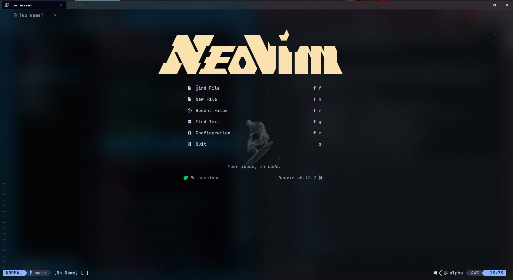
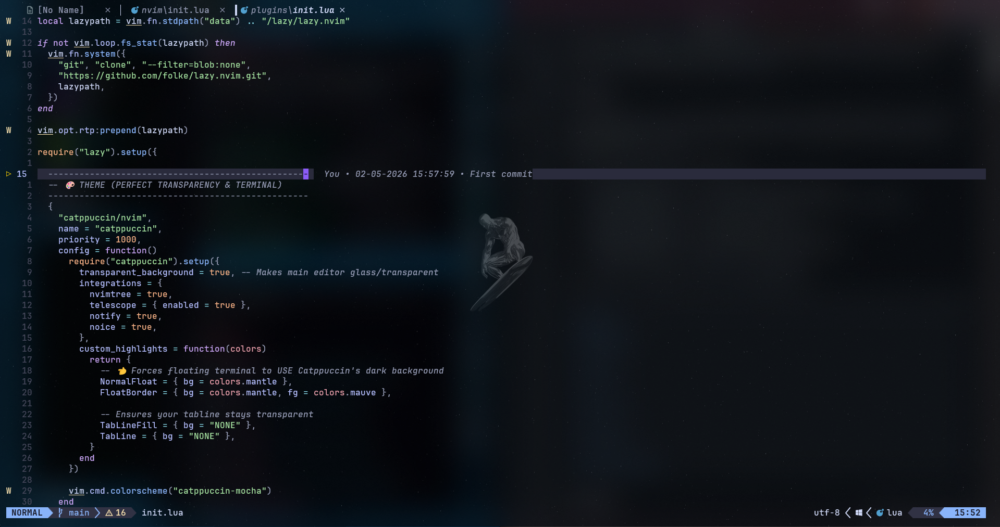
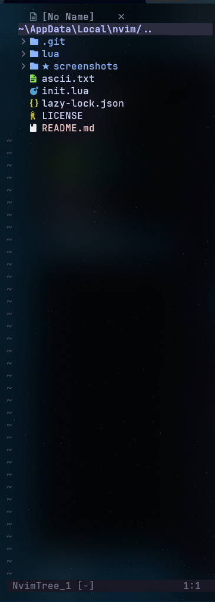
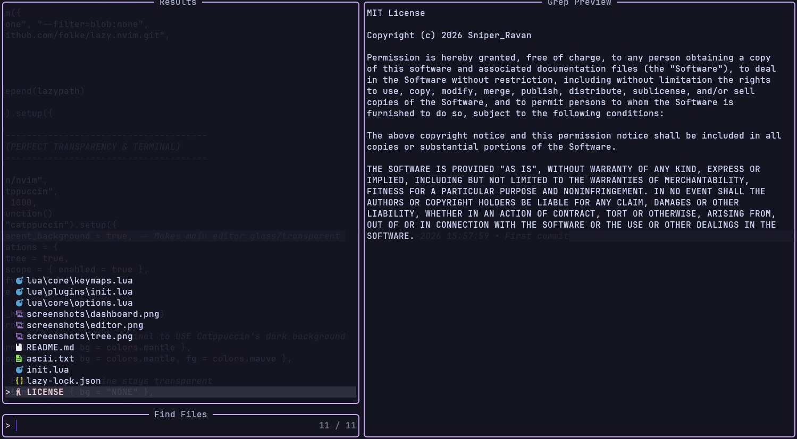
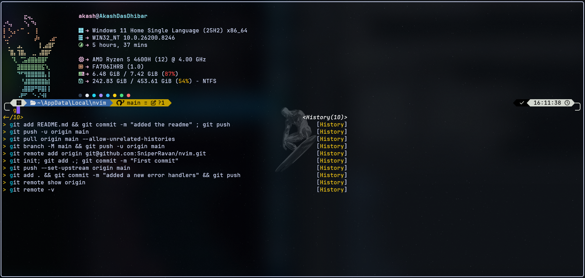

# Akash's Neovim Config

A modern, visual-first Neovim setup for Windows & Linux with a transparent Catppuccin look, a custom Alpha dashboard, floating terminal workflow, file explorer, Telescope search, LSP, autoformatting, and frontend-friendly utilities such as Markdown Preview and Live Server.

This repository is designed to be cloned directly into the Neovim config directory and used as a personal daily-driver configuration. The layout is modular, easy to edit, and built with `lazy.nvim` for plugin management and reproducible installs through a lockfile.

> **NOTE :**
> This config is currently developed on Windows, but it can also be used on Linux with small platform-specific adjustments such as the terminal shell settings.

## Preview

This configuration aims for a clean and polished experience with a strong visual identity. The theme layer is built around Catppuccin Mocha, transparent editor surfaces, styled floating windows, and a dashboard landing page powered by Alpha.

Suggested screenshots to add to the repository:

- `screenshots/dashboard.png` — startup dashboard with ASCII header
- `screenshots/editor.png` — code editing view with statusline, bufferline, and diagnostics
- `screenshots/tree.png` — nvim-tree open on the left side
- `screenshots/telescope.png` — Telescope file picker or live grep
- `screenshots/terminal.png` — floating terminal powered by ToggleTerm
- `screenshots/lsp.png` — LSP completion or inline diagnostics

Once screenshots are added, this section can be updated like this:


## Preview

### Dashboard


### Editor


### File Tree


### Telescope


### Floating Terminal



## Features

- Catppuccin Mocha theme with transparent background and custom floating window styling.
- Alpha dashboard with custom ASCII art, quick action buttons, and a version footer.
- `nvim-tree` sidebar for project navigation with git highlighting and indent markers.
- Telescope fuzzy finder for file search and live grep.
- Treesitter-based syntax highlighting and indentation for Lua, JavaScript, HTML, CSS, and TypeScript.
- LSP support through `mason.nvim`, `mason-lspconfig.nvim`, and `nvim-lspconfig`.
- Autocompletion using `nvim-cmp` and `cmp-nvim-lsp`.
- Formatting on save using `conform.nvim` with Prettier and Stylua.
- Floating terminal using `toggleterm.nvim`, currently configured for PowerShell on Windows and easily adjustable for Linux shells.
- Smooth scrolling, smooth cursor animation, inline diagnostics, git signs, git blame, notifications, and Noice UI enhancements.
- Markdown live preview and simple live server integration for HTML/CSS/JS work.

## Repository Structure

```text
.
├── init.lua
├── lazy-lock.json
├── ascii.txt
└── lua
    ├── core
    │   ├── keymaps.lua
    │   └── options.lua
    └── plugins
        └── init.lua
```

## What Each File Does

### `init.lua`
This is the main entry point of the configuration. It loads the editor options, keymaps, and full plugin setup by requiring `core.options`, `core.keymaps`, and `plugins`.

### `lazy-lock.json`
This file pins plugin versions to exact commits so the setup stays reproducible across systems and reinstalls. Keeping this file in the repository helps avoid breakage from upstream plugin updates.

### `ascii.txt`
This file stores dashboard header ideas and ASCII banner variants. It is useful for preserving multiple visual styles even if only one banner is actively used in `lua/plugins/init.lua`.

### `lua/core/options.lua`
This file contains basic Neovim behavior and UI settings. It enables line numbers, relative numbers, 2-space indentation, true color, transparent blending, better splits, cursorline, signcolumn support, completion menu behavior, and clipboard sync with the system clipboard.

### `lua/core/keymaps.lua`
This file defines the leader key and most keyboard shortcuts. It also includes important autocmd logic for opening the dashboard on startup, reopening the dashboard when buffers close, opening the file tree automatically, styling terminal buffers, and autosaving frontend files for live preview workflows.

### `lua/plugins/init.lua`
This is the biggest file in the config and the core of the setup. It bootstraps `lazy.nvim`, declares all plugins, and configures the theme, dashboard, tree view, search, terminal, animations, notifications, LSP, formatter, autocompletion, and extra tools.

## Plugin Stack

| Area | Plugins |
|---|---|
| Plugin manager | `folke/lazy.nvim`  |
| Theme | `catppuccin/nvim`  |
| Dashboard | `goolord/alpha-nvim`  |
| File explorer | `nvim-tree/nvim-tree.lua`, `nvim-web-devicons`  |
| Search | `nvim-telescope/telescope.nvim`, `plenary.nvim`  |
| Syntax | `nvim-treesitter/nvim-treesitter`  |
| Status UI | `lualine.nvim`, `bufferline.nvim`  |
| Terminal | `toggleterm.nvim`  |
| Motion and cursor | `neoscroll.nvim`, `SmoothCursor.nvim`  |
| Notifications | `nvim-notify`, `noice.nvim`, `nui.nvim`  |
| Git | `gitsigns.nvim`, `git-blame.nvim`  |
| Diagnostics | `tiny-inline-diagnostic.nvim`  |
| LSP | `mason.nvim`, `mason-lspconfig.nvim`, `nvim-lspconfig`  |
| Completion | `nvim-cmp`, `cmp-nvim-lsp`, `LuaSnip`  |
| Formatting | `conform.nvim`  |
| Web preview | `markdown-preview.nvim`, `live-server.nvim`  |

## How It Works

The config starts in `init.lua`, where the setup is split into three layers: editor behavior, keymaps, and plugins. This keeps the code easy to maintain and makes it simpler to find what needs to be changed when customizing the setup.

`lazy.nvim` handles plugin installation and loading. On first startup, Neovim checks whether the plugin manager exists locally; if it does not, the config clones it automatically and then loads the rest of the plugin definitions from `lua/plugins/init.lua`.

The theme system is based on Catppuccin with transparency enabled and custom highlights for floating windows and tabline surfaces. That gives the setup its glass-like appearance while still keeping floating windows readable.

The dashboard uses Alpha and a custom multi-line ASCII header. It also defines shortcut buttons for finding files, making a new file, opening recent files, running live grep, opening the configuration, and quitting Neovim.

The keymap layer gives quick access to the file explorer, Telescope search, terminal, markdown preview, live server, window navigation, and buffer switching. Several autocmds add workflow polish by automatically opening the tree, styling terminal windows, and returning to the dashboard when the last listed buffer closes.

For coding features, Mason installs language servers, `nvim-lspconfig` enables them, `nvim-cmp` provides completion, Treesitter improves syntax highlighting, and Conform formats files on save. In this setup, the primary target languages are Lua, JavaScript, TypeScript, HTML, and CSS.

## Default Keymaps

| Keymap | Action |
|---|---|
| `<leader>e` | Toggle file explorer  |
| `<leader>ff` | Find files with Telescope  |
| `<leader>fg` | Live grep with Telescope  |
| `<leader>h` | Move to left split  |
| `<leader>j` | Move to lower split  |
| `<leader>k` | Move to upper split  |
| `<leader>l` | Move to right split  |
| `<S-h>` | Previous buffer  |
| `<S-l>` | Next buffer  |
| `<leader>t` | Open floating terminal  |
| `<leader>q` | Quit all buffers immediately  |
| `<leader>mp` | Toggle Markdown Preview  |
| `<leader>ls` | Start Live Server  |
| `<leader>lx` | Stop Live Server  |

## Requirements

Before using this setup, install the following tools on Windows:

- Neovim
- Git
- Node.js and npm because `markdown-preview.nvim` runs `npm install` in its app directory during setup.
- A Nerd Font so dashboard icons, devicons, and UI glyphs render correctly
- Optional but recommended: `prettier` and `stylua` support through Mason or local tooling, depending on workflow.

#### Windows
- PowerShell (`pwsh`) because the terminal configuration explicitly uses `pwsh -NoLogo`.

#### Linux
- A working shell such as `bash`, `zsh`, or `fish`
- Clipboard support tools may be needed depending on the system
- On Debian-based systems, install `xclip` or `wl-clipboard` if clipboard integration does not work

## Installation

### Windows

1. Back up any existing Neovim config.

```powershell
Rename-Item "$env:LOCALAPPDATA\nvim" "nvim.backup"
```

2. Clone this repository into the Neovim config directory.

```powershell
git clone https://github.com/<your-username>/<your-repo>.git "$env:LOCALAPPDATA\nvim"
```

3. Start Neovim.

```powershell
nvim
```

### Linux

1. Back up any existing Neovim config.

```bash
mv ~/.config/nvim ~/.config/nvim.backup
```

2. Clone this repository into the Neovim config directory.

```bash
git clone https://github.com/<your-username>/<your-repo>.git ~/.config/nvim
```

3. Start Neovim.

```bash
nvim
```
### After first launch

1. Wait for `lazy.nvim` to install plugins on first launch. This config bootstraps the plugin manager automatically if it is missing.

2. Run health checks after the first install.

```vim
:checkhealth
:Mason
:Lazy
```

## Linux shell note

The floating terminal is currently configured with:

```lua
shell = "pwsh -NoLogo"
```

That works well on Windows, but Linux users may want to change it to:

```lua
shell = "bash"
```

or:

```lua
shell = "zsh"
```

This setting is inside `lua/plugins/init.lua`.

## First-Run Notes

On the first launch, plugin installation may take some time depending on internet speed and whether Node-related dependencies need to be installed for Markdown Preview. The lockfile helps keep plugin versions stable after the initial setup.

The dashboard should appear when Neovim starts without a file argument. When a file is opened, the tree can auto-open and then focus returns to the active buffer, which creates a project-style layout automatically.

## Customization

### Change the dashboard banner
Replace `dashboard.section.header.val` in `lua/plugins/init.lua` with another banner from `ascii.txt`.

### Change the theme
Edit the Catppuccin section in `lua/plugins/init.lua` and switch the flavour or highlight overrides.

### Change keymaps
Edit `lua/core/keymaps.lua` to remap leader commands, split navigation, or workflow shortcuts.

### Add languages
Update Treesitter, Mason, and LSP setup blocks in `lua/plugins/init.lua` to include more languages.

### Change formatting behavior
Update the `conform.nvim` formatter table in `lua/plugins/init.lua` if you want language-specific formatters.

## What to Push to GitHub

These files are enough for sharing the actual configuration:

- `init.lua`
- `lazy-lock.json`
- `ascii.txt`
- `lua/core/options.lua`
- `lua/core/keymaps.lua`
- `lua/plugins/init.lua`
- `README.md`
- `.gitignore`
- `screenshots/` directory after adding images

Do not push runtime caches, installed plugins, swap files, or temporary editor state. Those files are machine-specific and should stay out of version control.

## Recommended Screenshot Names

Create a `screenshots` folder in the repo and save images with these names:

```text
screenshots/
├── dashboard.png
├── editor.png
├── tree.png
├── telescope.png
├── terminal.png
└── lsp.png
```

A good screenshot set makes the repository much closer in spirit to showcase-style Neovim repos such as `jdhao/nvim-config`, which presents the setup visually and explains installation and structure clearly.

## Troubleshooting

### Icons look broken
Install and enable a Nerd Font in the terminal emulator.

### Markdown preview does not open
Make sure Node.js and npm are installed because the plugin uses an app build step.

### Floating terminal does not work
Make sure `pwsh` is available in PATH because ToggleTerm is configured to launch PowerShell directly.

### LSP does not attach
Open `:Mason` and confirm the required servers are installed. In this config, the intended servers are `lua_ls`, `ts_ls`, `html`, and `cssls`.

### Formatting does not run
Check whether the formatter for the current filetype is installed and available. The config maps JavaScript, TypeScript, HTML, CSS, JSON, and Lua to formatters through Conform.

## License

This project is licensed under the MIT License - see the [LICENSE](LICENSE) file for details.